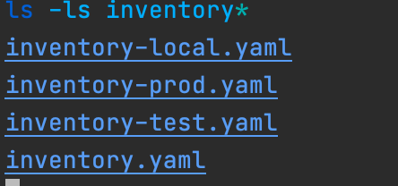
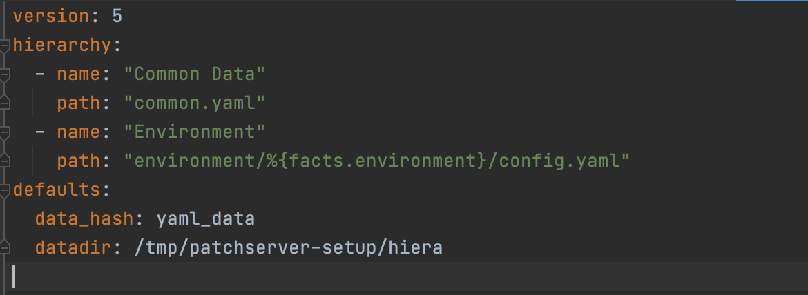
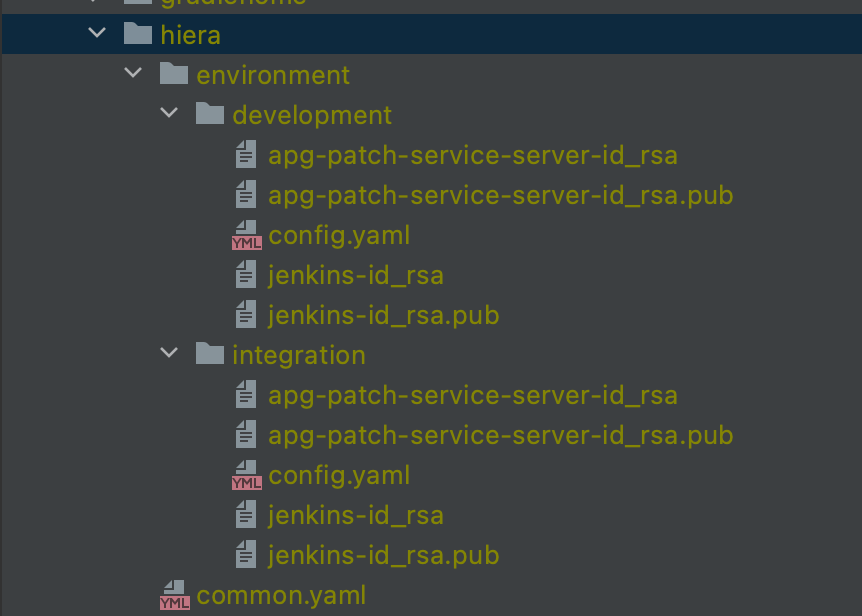
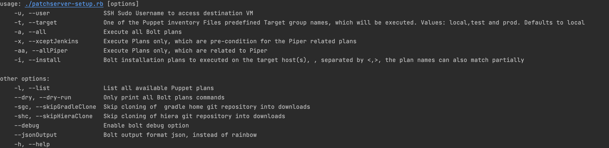
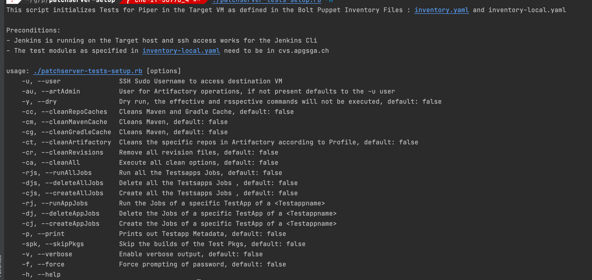

# Apg Patch Server Setup

Provides a automated initial setup and configuration of the Apg Patch
Server with Jenkins initially for Local testing and Development. For
Piper see the [Github Repo]() .

## Preconditions

1. A
   [Minimal Centos 7](http://linuxsoft.cern.ch/centos/6.10/isos/x86_64/CentOS-6.10-x86_64-minimal.iso)
   installation
2. User / password with sudo rights for the target machine running. This
   user should also have a public rsa key in the default location.
3. A ssh public key in the user home on the host machine
4. Ruby, Version: jruby-9.2.11.1, installed on the Host machine, see
   [Apg Wiki](https://intranet.apgsga.ch/display/itwi/Ruby)
5. The target host added as ssh known host to the user, which the
   installation will be done .
6. Bolt Version 3.0.0 installed on the Host machine. For Bolt
   installation see the
   [Puppet Site](https://puppet.com/docs/bolt/latest/bolt_installing.html)
7. The necessary Puppet modules are installed locally:  `bolt puppetfile
   install` in the root directory of the project
8. Tested Host Enviroments: Macos Big Sur, WSL Ubuntu 18.04 Lts, Windows
   Native will probably not work

## Before running the Setup

After cloneing this repo from Github :
https://github.com/apgsga-it/patchserver-setup, run:

`bolt module install`

This installs the necessary bolt modules.

Then run:

`bundle install `

This installs the necessary Ruby gems for the ruby scripts.

Note:  You maybe have to add the authentication information first within GemFile. To do this, edit the GemFile file, and update the following line:

- source 'https://artifactory4t4apgsga.jfrog.io/artifactory/api/gems/apgGems' do

with:

- source 'https://\<artifactoryUser>:\<artifactoryUserPwd>@artifactory4t4apgsga.jfrog.io/artifactory/api/gems/apgGems' do

## Project Organization

The Installation process supports 3 environment target types:
development, integration and production. The development is intended for
installation in a local vm. Integration and production for centralized
servers.

The [Puppet plans](plans) , are always run from the Setup script:
[patchserver-setup.rb](patchserver-setup.rb) , see below for more
details.

The Parameters, which drive the Puppet Installation are organized into
inventory files, hiera data and command line parameters.

And naturally the Bolt Project itself.

### Inventory Files

Inventory file data are retrieved from the executing plans as target specific context data.

The inventory files are organized as follows:

The File [inventory.yaml](inventory.yaml) contains the global installation parameters for
the setup, which are the same for all targets.

The Files [inventory-prod.yaml](inventory-prod.yaml) and [inventory-test.yaml](inventory-test.yaml) contain the
parameters specific to the production resp integration test environment.

The File [inventory-local.yaml](inventory-local.yaml) contains the specific installation
parameter, which are specific to the Developers needs. This file needs
to be adopted for local testing.

Bolt merges the respective contexts for a target group.

### Hiera Data

Hiera Data is retrieved in the plan by specific lookup functions.  
We generally store security sensitive data in Hiera.

The Hiera data is kept in a separate Apg internal Git repository and is
cloned into a project specific directory in /tmp upon
starting the [patchserver-setup.rb](patchserver-setup.rb).

Hiera Access is configured in the file [hiera.yaml](hiera.yaml):

The Hiera Data Storage structure is a the moment as follows:

### Bolt / Puppet

The Bolt project configuration is in
[bolt-project.yaml](bolt-project.yaml)

The Puppet plans in the Directory [plans](plans)

Plans, which currently not used are in [inactive-plans](inactive-plans)

Templates, which are used by Puppet plans are in [templates](templates)

### Command Line

As mentioned the workflow, ordering of the plans, command line
parametrization and execution of the Puppet Plans is done with Ruby
Script: [patchserver-setup.rb](patchserver-setup.rb)

Here the dislay of the options available:

The option --user is a required parameter and is the user, which has the
Sudo rights for the target.

The password is prompted upon execution of the script.

The option --target is one of local, test and prod. It defaults to
local.

The options -a , -x , -aa and i are exclusive: one of the 4 needs to be
specified.

Option a : All plans are executed.  
Option -x: All plans, which are not Piper specific are executed Option
Option -aa: All Piper specific plans.  
Option -i : Takes comma sperated parameters. The parameters are matched
against the available plans.

Options --dry: Only prints out what would be executed.

## Running the Setup

Basically the Setup should be able to run unattended, after the Password
of the User has been entered.

Possible problems:

Target machine not available, either the ip address or host name in  
one of the inventory files is wrong or network problems

The Password is wrong, this leads to nasty error messages,  
since the password is checked initially.

A plan has an error.... hmmmmm

Typical usage scenario by example for user <che>

`./patchserver-setup.rb -u che -a # Runs all plans for default target local`

`./patchserver-setup.rb -u che --target test -a # Runs all plans for target test`

`./patchserver-setup.rb -u che --target local -x # Runs all non Piper plans for target local`

`./patchserver-setup.rb -u che --target local -aa # Runs all Piper plans for target local`

The setup will need depending between 10 - 20 min..... best go and drink
a coffee and/or due some exercises ;-)

## Test Setup Scripts for initializing Tests on a Patchserver Target

This repo contains a [script](patchserver-tests-setup.rb), which has
different options for , among other
- Deleting the Maven Local and the gradle Cache on the target host
- Emptying the Artifactory test repos according the Maven Profile
  settings
- Creating the Testjobs according to
  [inventory-local.yaml](./inventory-local.yaml), all or selectively by
  Testapp
- Deleting Testjobs according to
  [inventory-local.yaml](./inventory-local.yaml), all or selectively by
  Testapp
- Running all Testjobs according to
  [inventory-local.yaml](./inventory-local.yaml),, all or selectively

The configuration is pulled from the
[Bolt inventory file](./inventory.yaml) of the Puppet Setup of the
Target and the local
[Configuration of the Testapp Metadata](./inventory-local.yaml)

The Artifactory admin user needs to be configured in the above file.

Preconditions:
- Jenkins running in the target VM running on the IP Address, according
  to [inventory-local.yamll](./inventory-local.yaml)
- The
  [Bolt Inventory file](https://github.com/apgsga-it/patchserver-setup/blob/master/inventory.yaml)
  needs to reflect the running Target Server and accessible  on the local
  file system
- Ssh access for the Jenkins CLI ist setup
- The Testapps are assumed to be in cvs.apgsga.ch

## Usage

with the -h or --help option, you see the following

### Configuration

The Configuration is taken from the file
[inventory-local.yaml](./inventory-local.yaml) and from the Bolt Puppet
[Inventory file](https://github.com/apgsga-it/patchserver-setup/blob/master/inventory.yaml).

Both must reflect the current state of the running target.

### Usage Scenarios

Clean the local Maven and Gradle Repositories on the Target in Dry Mode:

`./init-jenkins-tests.rb --cleanCache --dry `

Empty the test specific Artifactory  Repositories

`./init-jenkins-tests.rb --cleanArtifactory`

Create all Tests Jobs according to
[inventory-local.yaml](./inventory-local.yaml)

`./init-jenkins-tests.rb --createAllJobs`

Create Tests Jobs for a specific Testapp according to
[inventory-local.yaml](./inventory-local.yaml)

`./init-jenkins-tests.rb --createAppJobs testapp`

The options can be combined

`./init-jenkins-tests.rb --cleanCache --cleanArtifactory --createAllJobs --verbose`

If uncertain about the effects of the script best use the `--dry` option

## Open Points / Todos

- [ ] Artifactory and Maven Profile by convention
- [ ] Secrets/ Passwords : Heira Data encrypted
- [ ] Hiera Files : Read with File gems
- [ ] Additional Jenkins Users
- [ ] Exclude local target specific plans for prod and test

