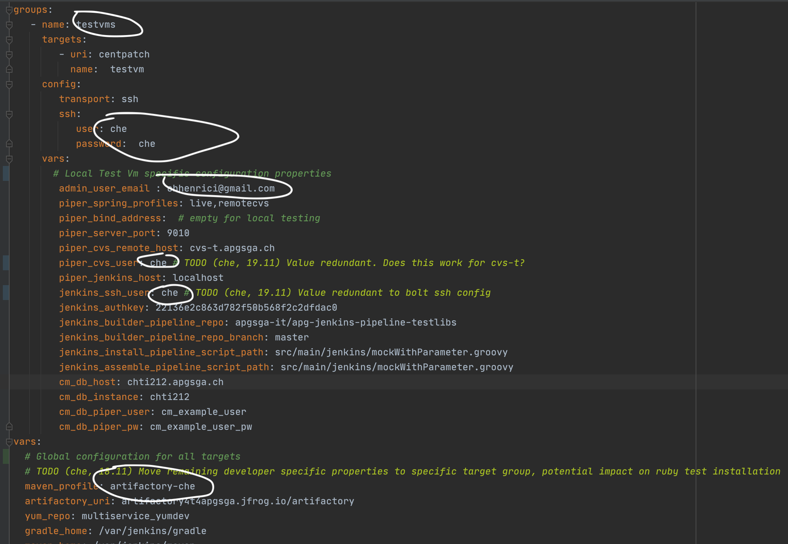
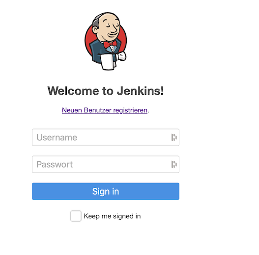
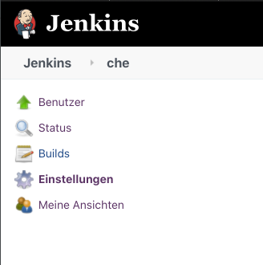
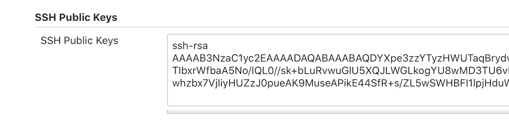
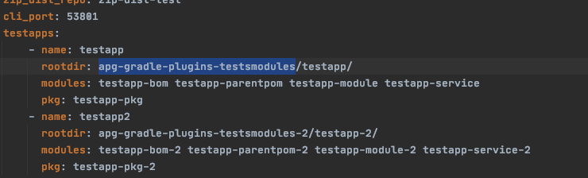
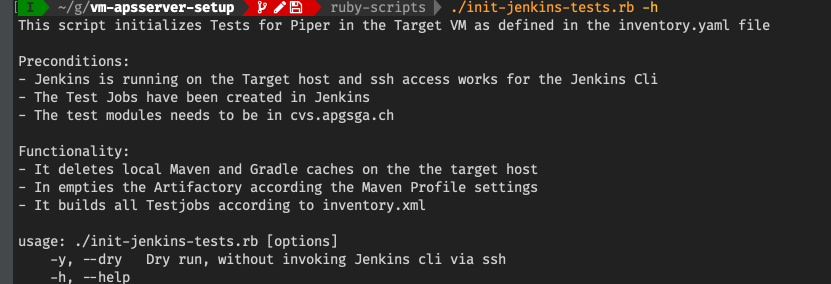
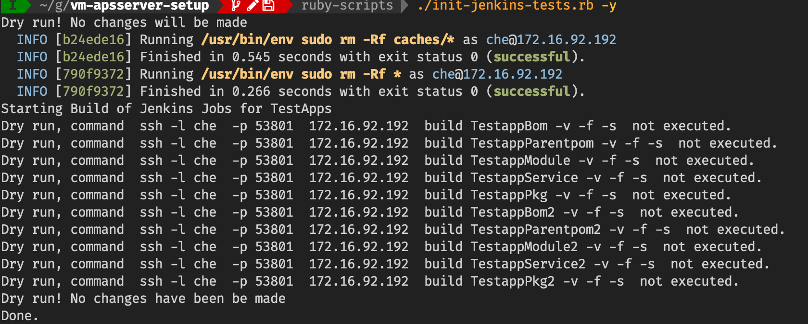

# Apg Patch Server Setup

Provides a mostly automated initial setup and configuration of the Apg
Patch Server with Jenkins for Localtesting and Development. For Piper
see the [Github Repo]() .

## Preconditions

1. A
   [Minimal Centos 7](http://linuxsoft.cern.ch/centos/6.10/isos/x86_64/CentOS-6.10-x86_64-minimal.iso)
   installation with user / password with sudo rights on the target
   machine running.
2. Configuration of Bolt Hiera for passwords use , see seperate
   description below
3. Bolt installed on the Host machine. For Bolt installation see the
   [Puppet Site](https://puppet.com/docs/bolt/latest/bolt_installing.html)
4. Ruby installed on the Host machine, see the
   [Ruby Site](https://www.ruby-lang.org/de/documentation/installation/)
   , preferably with [Rbenv](https://github.com/rbenv/rbenv)
5. At least the target host added as ssh known host to the user, which
   the installation will be done.

### Set-up Bolt Hiera Config for Passwords

1. `cp templates/hiera.yaml ~/.puppetlabs/bolt`
2. ` cp -R templates/data ~/.puppetlabs/bolt`
3. `vim ~/.puppetlabs/bolt/data/common.yaml ` and change TOBECHANGED to
   the correct value

The location of the root configuration directory can be changed in
bolt.yaml

## Running the Setup

### Installation Parameters

The installation parameters are kept in the **inventory.yaml** file in
the root directory git repository.

Before the installation this file should be adpated accordingly.

See in that file the tag vars:

Specially important the following parameters:

1. target uri => the guest vm
2. ssh user => the sudo user of the vm
3. ssh password
4. maven_profile : the maven profile which will be used for gradle and
   maven

### Before running the Bolt Plans

The current apg *gradlehome git repo* , or the version you intend to
use, needs to be cloned manually to /tmp/gradlehome:

`git clone <user>@git.apgsga.ch:/var/git/repos/apg-gradle-properties.git
/tmp/gradlehome `

This step can be also automated with the ./install.rb script -c option,
see below

### Run Bolt Plans With Ruby installed

Run the setup with

`./install.rb -a -c`

to run from scratch. The c option clones the above mentioned apg gradle
home git repo automatically

`./install.rb -t git,cvs,java `

To run plans selectively. In this case git, cvs and java.

To list all options, run :

`./install.rb -h`

### Run Bolt Plans without Ruby

Run

`bolt plan run piper::java_install --concurrency 10 -t testvms`

And repeat accordingly for the following plans:

- piper::apg_yum_repo
- piper::cvs_install
- piper::git_install
- piper::gradle_install
- piper::java_install
- piper::maven_install
- piper:jenkins_install

The piper::jenkins_install plan necessarily as the last

### Defensive measures

If the **piper:jenkins_install** plan fails you need to start over
again, since unfortunately the piper:jenkins_install cannot be run
twice, the other plans yes.

So best is to run all plans except the piper::jenkins plan and then
create a **snapshot** of the VM

And then run the piper::jenkins plan.

With ruby installed you can do:

`./install.rb -x -a`

with runs all, except the jenkins_install.

And then, create a Snapshot and after run

`./install.rb -t jenkins`

The installation will take some time depending on the network speed,
between 5 min and 45 min.

## Post Installation

You need to follow the following steps to make your installation usable

### Establish Jenkins End User
When the piper::jenkins_install has been executed, you should be able to
point to http:<ip>:8080 and get the User / Password page.

Create a new User.

### Configure Jenkins User / Public ssh Key

In Order to be able to use the
[Jenkins Cli](https://www.jenkins.io/doc/book/managing/cli/) , the
public rsa key of the host user most be copied to Jenkins User
Configuration:

Paste from `cat ~/.ssh/id_rsa.pub` to

Some Helper Scripts use the
[Jenkins Cli](https://www.jenkins.io/doc/book/managing/cli/)

### Create Jenkins system user rsa public key for cvs-t ssh

In order for jenkins jobs to be able to co from cvs-t.apgsga.ch you need
to do the following on the target mashine:

1. `sudo passwd jenkins -f # Set a password for the jenkins user`
2. `su - jenkins # Login in as jenkins`
3. `ssh-keygen # generate a public for jenkins, you can use all
   defaults`
4. `ssh-copy-id <user>@cvs-t.apgsga.ch #copy the key using your id`

### Configure Piper

After Piper has been installed, we have to configure the following:

1. vi /etc/opt/apg-patch-service-server/application.properties and

    a. vcs.host=cvs-t.apgsga.ch
    
    b. jenkins.host=localhost
    
    c. jenkins.ssh.user=jhe # or the user define within your VM

2. systemctl restart apg-patch-service-server
3. logon as apg-patch-service-server (su apg-patch-service-server)
4. run "ssh localhost -p 53801 (you might get an error, doesn't matter, important is to see : Permanently added '[localhost]:53801' (RSA) to the list of known hosts)
5. run "ssh-keygen", accept all default
6. run "ssh-copy-id apg-patch-service-server@localhost"
7. run "cat ~/.ssh/id_rsa.pub" -> copy the output within Jenkins "SSH Public keys" of the user configured for jenkins.ssh.user property within /etc/opt/apg-patch-service-server/application.properties.

### Utility Scripts

The Utility Script described below should be run from

`cd ruby-scripts`

#### Create Test Build Jobs

We have a set off Test Modules and Applications in the following CVS
modules:

To create to Test Jobs in Jenkins, run in the root directory of the
repo:

` ./create-jenkins-testjobs.rb`

The *inventory.yaml * file will be consulted for the modules

For options and description run

` ./create-jenkins-testjobs.rb -h'

#### Initialize Jenkins VM Tests

To initialize a test Series in the VM there is a script:

The output of a dry run is :

## Open Points / Todos

- [ ] Automate User / Credentials Creation
- [ ] Automate Public RSA Key exchanges for Jenkins User & Jenkins
- [ ] Node credentials
- [ ] Align User/Groups to Apg Standard
- [ ] Move Target, User , Password from inventory.yaml back to commandline 
- [x] Support Apscli and Piper Installation from Yum

