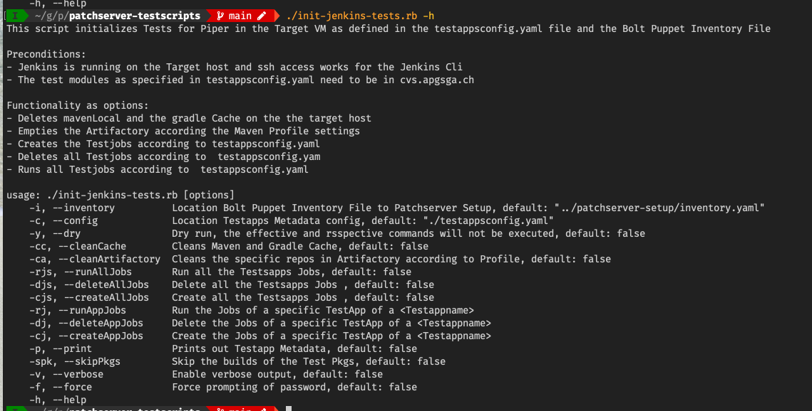

# Apg Patch Server Setup

Provides a automated initial setup and configuration of the Apg Patch
Server with Jenkins initially for Local testing and Development. For
Piper see the [Github Repo]() .

## Preconditions

1. A
   [Minimal Centos 7](http://linuxsoft.cern.ch/centos/6.10/isos/x86_64/CentOS-6.10-x86_64-minimal.iso)
   installation
2. User / password with sudo rights for the target machine running. This
   user should also have a public rsa key in the default location.
3. A ssh public key in the user home on the host machine
4. Configuration of Bolt Hiera for passwords use , see seperate
   description below
5. Ruby installed on the Host machine, see [Apg Wiki](https://intranet.apgsga.ch/display/itwi/Ruby),
6. The target host added as ssh known host to the user, which the
   installation will be done.
7. 
   Bolt installed on the Host machine. For Bolt installation see the
   [Puppet Site](https://puppet.com/docs/bolt/latest/bolt_installing.html)
8. The necessary Puppet modules are installed locally:  `bolt puppetfile
   install` in the root directory of the project

### Set-up Bolt Hiera Config for Passwords

The initial hiera configuration file
[common.yaml.initial](./hiera-data/common.yaml.initial) in the directory
[hiera-data](./hiera-data) needs to be copied to the same directory to
common.yaml. This later file is ignored by git.

In this file the values with TOBECHANGED needs to be adopted accordingly
.

## Running the Setup

### Installation Parameters

The installation parameters are kept in th **inventory.yaml** file in
the root directory git repository.

Before the installation this file should be adapted accordingly.

See in that file the tag vars:

The structure of the **inventory.yaml** file supports multiple target
groups, which can have differing parameters. Currently, only the testvm
group has been tested. This group and configuration is intended for
local test vms.

Important are the following parameters:

1. target uri => the target address vm
2. ssh user => the sudo user of the target vm
3. ssh password
4. maven_profile : the maven profile which will be used for gradle and
   maven

Note : *maven_profile* tag is currently a global property.

### Before running the Bolt Plans

The current apg *gradlehome git repo* , or the version you intend to
use, needs to be cloned manually to /tmp/gradlehome:

`git clone <user>@git.apgsga.ch:/var/git/repos/apg-gradle-properties.git
/tmp/gradlehome `

This step is also the ./patchserver-setup.rb script -c option, see below

### Run Bolt Plans

To run the plans , you use the script ./patchserver-setup.rb in the root directory
of the repo.

To list all availabe options, run :

`./patchserver-setup.rb -h`

To see, which plans are available and in which order they should be
executed, run:

`./patchserver-setup.rb -a -c --dry`

You will the following output:

These are all the Bolt Puppet Plans which are to be executed and  in the
correct order.

Without the --dry option all plans are executed sequentially.

The plans can be executed manually or via the ./patchserver-setup.rb script
depending on the --dry option. These options outputs the bolt commands
needed to be run.

Since running all the plans takes quite some time and may fail
(resources not available, network slow etc), it is advisable to split
the plan execution into reasonable groups. Also, VM Snapshots can be
taken.

For example run:

`./patchserver-setup.rb -a -c -x`

Which runs all plans needed to install jenkins, except the jenkins
specific plans and the plans dependent on jenkins.

Then the jenkins and piper plans can be run. To List them run

`./patchserver-setup.rb -i jenkins,piper_service`

The -i option takes a plan name filter, which is matched against the
plan names. So the above parameter will produce with the --dry option
the following output:

## Post Installation

You need to follow the following steps to make your installation usable

### Copy the Jenkins user ssh key to the cvs server

In order for jenkins jobs to be able to co from cvs-t.apgsga.ch you need
to copy the public ssh key to the user with which the jenkins jobs are
to run:
1. `su - jenkins`
2. `ssh-copy-id <user>@cvs-t.apgsga.ch #copy the key using your id`

### Configure Piper

After Piper has been installed, we have to configure the following:
1. login as sudo user of target
2. ssh-copy-id apg-patch-service-server@localhost

## User creation and management

**A.User, which runs Installation**

**B. Target Platform User with sudo rights**

The test user. This user is a
precondition for the installation

**C. Local Target Platform Users for the daemon processes**

jenkins

apg-patch-service-server

Both are created via Bolt plans. The piper rpm now checks in the pre
install step , if apg-patch-service-server exists and omits user
creation if yes.

**D. Public Keys**

The public rsa keys of A. und B. are precondition with the default
location ($HOME/.ssh/) assumed

The public rsa key of C. are created upon setup

**E. Jenkins Admin User**

The same user name / password as the Platform user , see B. The public
rsa key of A., B. and C. are held in the Jenkins User Configuration.
This allows the respective owners of the public  to interact via ssh with
the Jenkins Cli, example:

`ssh -l <user> -p 53801 <targethost> help`

This User is created via setup

**F. External Resources**

Cvs Server (cvs-t.apgsga.com):

Currently jenkins and the apg-patch-service-server daemon access the cvs
server with the current test user for the Installation, see B. eg. jhe ,
che, uge

Ssh Jenkins Commandline Port

Currently the apg-patch-service-server (C.) daemon and the local test
user (B.) and the Host user (A.) access the ssh port for the Jenkins Cli

## Testsript for initializing Tests on a Patchserver Target

This repo contains a [script](patchserver-tests-setup.rb), which has
different options for
- Deleting the Maven Local and the gradle Cache on the target host
- Emptying the Artifactory test repos according the Maven Profile
  settings
- Creating the Testjobs according to
  [inventory-local.yaml](./inventory-local.yaml), all or selectively by
  Testapp
- Deleting Testjobs according to
  [inventory-local.yaml](./inventory-local.yaml), all or selectively by
  Testapp
- Running all Testjobs according to
  [inventory-local.yaml](./inventory-local.yaml),, all or selectively

The configuration is pulled from the
[Bolt inventory file](./inventory.yaml) of the Puppet Setup of the
Target and the local
[Configuration of the Testapp Metadata](./inventory-local.yaml)

The Artifactory admin user needs to be configured in the above file.

Preconditions:
- Jenkins running in the target VM running on the IP Address, according
  to [inventory-local.yamll](./inventory-local.yaml)
- The
  [Bolt Inventory file](https://github.com/apgsga-it/patchserver-setup/blob/master/inventory.yaml)
  needs to reflect the running Target Server and accessible  on the local
  file system
- Ssh access for the Jenkins CLI ist setup
- The Testapps are assumed to be in cvs.apgsga.ch

## Installation required gems

The required gems are specified in the [Gemfile](Gemfile)<!-- @IGNORE PREVIOUS: link --> File.

To install these dependencies locally, execute

    $ bundle install

Note: You'll probably have to add the authentication information first within GemFile. To do this, edit the GemFile file, and update the following line:

- source 'https://artifactory4t4apgsga.jfrog.io/artifactory/api/gems/apgGems' do

with:

- source 'https://\<artifactoryUser>:\<artifactoryUserPwd>@artifactory4t4apgsga.jfrog.io/artifactory/api/gems/apgGems' do

## Usage

with the -h or --help option, you see the following

### Configuration

The Configuration is taken from the file
[inventory-local.yaml](./inventory-local.yaml) and from the Bolt Puppet
[Inventory file](https://github.com/apgsga-it/patchserver-setup/blob/master/inventory.yaml)
of the
[Patch Server Setup](https://github.com/apgsga-it/patchserver-setup).

Both must reflect the current state of the running target.

### Usage Scenarios

Clean the local Maven and Gradle Repositories on the Target in Dry Mode:

`./init-jenkins-tests.rb --cleanCache --dry `

Empty the test specific Artifactory  Repositories

`./init-jenkins-tests.rb --cleanArtifactory`

Create all Tests Jobs according to
[inventory-local.yaml](./inventory-local.yaml)

`./init-jenkins-tests.rb --createAllJobs`

Create Tests Jobs for a specific Testapp according to
[inventory-local.yaml](./inventory-local.yaml)

`./init-jenkins-tests.rb --createAppJobs testapp`

The options can be combined

`./init-jenkins-tests.rb --cleanCache --cleanArtifactory --createAllJobs --verbose`

If uncertain about the effects of the script best use the `--dry` option

## Open Points / Todos

- [ ] Move Target, User , Password from inventory.yaml back to
      commandline
- [ ] Review (and Revise) User Management and assumptions of the Setuo:
      Specific User for apg-patch-service-server for the Jenkins Cli ssh
      port. Currently the local test user. Specific User for the cvs daemon accesses (jenkins and the
      apg-patch-service-server). Currently the local test user.
- [ ] Move maven_profile inventory.xml property to target group specfic
- [ ] Production Target Group properties in inventory.xml. Very plans
      and properties in terms of Production target requirements
- [ ] Parameterization of the plans, currently the plans have a uniform
      parameter = targets, which is taken from the inventory.xml. Some
      plans could be parametrized individually, which the parameters
      passed through command line, eg the jenkins_account_create.pp a
      list of users could be passed
- [ ] Secrets/ Passwords : Which data should be managed with Puppet
      Hiera. Should the secrets resp the default passwords for the
      accounts, which are created , modified handled in a better way?
- [ ] Gradle Home for Jenkins: pulled directly from git or copied and
      git stripped
- [ ] Probably we have a ssh-id-copy missing -> for
      apg-patch-service-server access of the cvs server.

