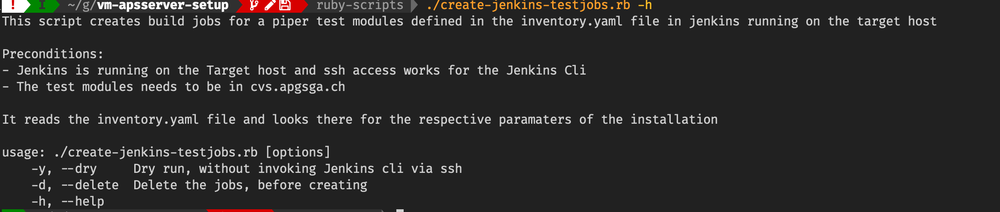

# Apg Piper Server Setup

Provides a mostly automated initial setup and configuration of the Apg
Patch Server with Jenkins for Localtesting and Development. For Piper
see the [Github Repo]() .

## Preconditions

1. A
   [Minimal Centos 7](http://linuxsoft.cern.ch/centos/6.10/isos/x86_64/CentOS-6.10-x86_64-minimal.iso)
   installation with user / password with sudo rights on the target
   machine running.
2. Bolt installed on the Host machine. For Bolt installation see the
   [Puppet Site](https://puppet.com/docs/bolt/latest/bolt_installing.html)
3. Ruby installed on the Host machine, see the
   [Ruby Site](https://www.ruby-lang.org/de/documentation/installation/)
   , preferably with [Rbenv](https://github.com/rbenv/rbenv)
4. At least the target host added as ssh known host to the user, which
   the installation will be done.

## Running the Setup

### Installation Parameters

The installation parameters are kept in the **inventory.yaml** file in
the root directory of the directory.

Before the installation this should be adpated accordingly.

See in that file the tag vars:

Specially important the following parameters:

1. user => the jenkins user
2. user_mail => his mail adress
3. maven_profile : the maven profile which will be used for gradle and
   maven

### Before running the Bolt Plans

The current apg *gradlehome git repo* , or the version you intend to
use, needs to be cloned manually to /tmp/gradlehome:

`git clone <user>@git.apgsga.ch:/var/git/repos/apg-gradle-properties.git
/tmp/gradlehome `

### Run Bolt Plans With Ruby installed

Run the setup with

`./install.rb -a -u <user> -p <pw> -t <ip>`

to run from scratch.

`./install.rb -t git,cvs,java -u <user> -p <pw> -t <target ipadress>`

to run plans selectively. In this case git, cvs and java.

To list all options, run :

`./install.rb -h`

### Run Bolt Plans without Ruby

Run

`bolt plan run piper::java_install --concurrency 10 --targets=<ip> -u
<user> -p <pw>`

And repeat accordingly for the following plans:

- piper::cvs_install
- piper::git_install
- piper::gradle_install
- piper::maven_install
- piper::jenkins_install

The piper::jenkins_install plan necessarily as the last

### Defensive measures

If the **piper:jenkins_install** plan fails you need to start over
again, since unfortunately the piper:jenkins_install cannot be run
twice, the other plans yes.

So best is to run all plans except the piper::jenkins plan and then
create a **snapshot** of the VM

And then run the piper::jenkins plan.

With ruby installed you can do:

`./install.rb -x -a -u <user> -p <pw> -t <ip>`

The installation will take some time depending on the network speed,
between 5 min and 45 min.

### After piper::jenkins_install

You need to follow the following steps to make your installation usable

*1 Establish Jenkins End User*

When the piper::jenkins_install has been executed, you should be able to
point to http:<ip>:8080 and get the User / Password page.

Create a new User.

***2 Configure Jenkins User / Public ssh Key***

In Order to be able to use the
[Jenkins Cli](https://www.jenkins.io/doc/book/managing/cli/) , the
public rsa key of the host user most be copied to Jenkins User
Configuration:

Paste from `cat ~/.ssh/id_rsa.pub` to

Some Helper Scripts use the
[Jenkins Cli](https://www.jenkins.io/doc/book/managing/cli/)

***2 Create Jenkins system user rsa public key for cvs-t ssh***

In order for jenkins jobs to be able to co from cvs-t.apgsga.ch you need
to do the following on the target mashine:

1. `sudo passwd jenkins -f # Set a password for the jenkins user`
2. `su - jenkins # Login in as jenkins`
3. `ssh-keygen # generate a public for jenkins, you can use all
   defaults`
4. `ssh-copy-id <user>@cvs-t.apgsga.ch #copy the key using your id`

***3 Create Jenkins Tests Build Jobs***

Note: Currently only Maven Job Creation is supported

To create to Test Jobs in Jenkins run in the root directory of the repo:

` ./create-jenkins-testjobs.rb -u <user? -t <ip> `

The *inventory.yaml * file will be consulted for the modules

For options and description run:

## Open Points / Todos

- [ ] Automate cloning of gradle home git repo
- [ ] Decide on Jenkins User Generic vs Specific
- [ ] Automate User / Credentials Creation
- [ ] Automate Public RSA Key exchanges for Jenkins User& Jenkins
- [ ] Node credentials
- [ ] Support additional Jobs Creation : Gradle / Job DsL Jobs

