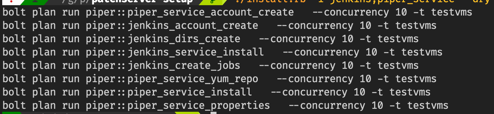

# Apg Patch Server Setup

Provides a mostly automated initial setup and configuration of the Apg
Patch Server with Jenkins for Localtesting and Development. For Piper
see the [Github Repo]() .

## Preconditions

1. A
   [Minimal Centos 7](http://linuxsoft.cern.ch/centos/6.10/isos/x86_64/CentOS-6.10-x86_64-minimal.iso)
   installation
2. User / password with sudo rights for the target machine running. This
   user should also have a public rsa key in the default location.
3. Bolt installed on the Host machine. For Bolt installation see the
   [Puppet Site](https://puppet.com/docs/bolt/latest/bolt_installing.html)
4. Configuration of Bolt Hiera for passwords use , see seperate
   description below
5. Ruby installed on the Host machine, see [Apg Wiki](https://intranet.apgsga.ch/display/itwi/Ruby),
6. The target host added as ssh known host to the user, which the
   installation will be done.

### Set-up Bolt Hiera Config for Passwords

1. `cp templates/hiera.yaml ~/.puppetlabs/bolt`
2. ` cp -R templates/data ~/.puppetlabs/bolt`
3. `vim ~/.puppetlabs/bolt/data/common.yaml ` and change TOBECHANGED to
   the correct value

The location of the root configuration directory can be changed in
bolt.yaml

## Running the Setup

### Installation Parameters

The installation parameters are kept in the **inventory.yaml** file in
the root directory git repository.

Before the installation this file should be adapted accordingly.

See in that file the tag vars:

The structure of the **inventory.yaml** file supports multiple target
groups, which can have differing parameters. Currently, only the testvm
group has been tested. This group and configuration is intended for
local test vms.

Import are the following parameters:

1. target uri => the guest vm
2. ssh user => the sudo user of the vm
3. ssh password
4. maven_profile : the maven profile which will be used for gradle and
   maven

Note : The global property *maven_profile* must also be adapted
accordingly. This should not be a global property.

### Before running the Bolt Plans

The current apg *gradlehome git repo* , or the version you intend to
use, needs to be cloned manually to /tmp/gradlehome:

`git clone <user>@git.apgsga.ch:/var/git/repos/apg-gradle-properties.git
/tmp/gradlehome `

This step can be also automated with the ./install.rb script -c option,
see below

### Run Bolt Plans

To run the plans , you use the script ./install.rb in the root directory
of the repo.

To list all availabe options, run :

`./install.rb -h`

To see, which plans are available and in which order they should be
executed, run:

`./install.rb -a -c --dry`

You will the following output:

These are all the Bolt Puppet Plans which need to be executed in the
correct order.

Without the --dry option all plans are executed sequentially.

The plans can be executed manually or via the ./install.rb script
depending on the --dry option. These options outputs the bolt commands
needed to be run.

Since running all the plans takes quite some time and may fail
(resources not available, network slow etc), it is advisable to split
the plan execution into reasonable groups. Also, VM Snapshots can be
taken.

For example run:

`./install.rb -a -c -x`

Which runs all plans needed to install jenkins, except the jenkins
specific plans and the plans dependent on jenkins.

Then the  jenkins plans can be run. To List them run

`./install.rb -i jenkins`

The -i option takes a plan name filter, which is matched against the
plan names. So the above parameter will produce with the --dry option
the following output:

And then the piper server specific plans:

`./install.rb -i piper_service`

## Post Installation

You need to follow the following steps to make your installation usable

### Copy the Jenkins user ssh key to the cvs server

In order for jenkins jobs to be able to co from cvs-t.apgsga.ch you need
to copy the public ssh key to the user with which the jenkins jobs are
to run:

4. `ssh-copy-id <user>@cvs-t.apgsga.ch #copy the key using your id`

### Configure Piper

TODO (che, 19.11) : needs to be revised and automated with bolt plans

After Piper has been installed, we have to configure the following:

1. logon as apg-patch-service-server (su apg-patch-service-server)
2. run "ssh localhost -p 53801 (you might get an error, doesn't matter,
   important is to see : Permanently added 'localhost:53801' (RSA) to
   the list of known hosts)
3. run "ssh-keygen", accept all default
4. run "ssh-copy-id apg-patch-service-server@localhost"
5. run "cat ~/.ssh/id_rsa.pub" -> copy the output within Jenkins "SSH
   Public keys" of the user configured for jenkins.ssh.user property
   within /etc/opt/apg-patch-service-server/application.properties.

## Open Points / Todos

- [ ] Revise inventory.xml parameters (completeness, naming, necessary
      etc)
- [ ] Move maven_profile inventory.xml property to target group specfic
- [ ] Production Target Group properties in inventory.xml
- [ ] Review (and Revise) Jenkins User(s) configuration and setup
- [ ] Review (and Revise) Piper User configuration and setup
- [ ] Move Testscripts in patchserver-testscripts back to
      patchserver-setup repository
- [ ] Automate manual steps for Piper Setup => ssh key management
- [ ] Move Target, User , Password from inventory.yaml back to commandline
- [ ] Piper Service default Install, currently the rpm produces a
      installation, which does not run, but assumes that the *.intitial
      properties will be adapted
- [ ] Parameterization of the plans, currently the plans have a uniform
      parameter = targets, which is taken from the inventory.xml. Some
      plans could be parametrized individually, which the parameters
      passed through command line, eg the jenkins_account_create.pp a
      list of users could be passed
- [ ] Test Piper apscli scenarios
- [ ] To discuss : Static IP Pool for Test VM's
- [ ] To discuss : Initial Test Image (Centos Minial , plus eg chronyd,
      viscocity client service etc, test user) provided?
- [ ] More detail described of what is done in the individual plans,
      specially in the non - trivial ones

